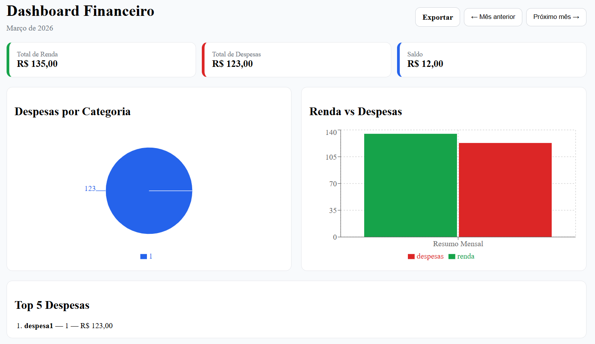
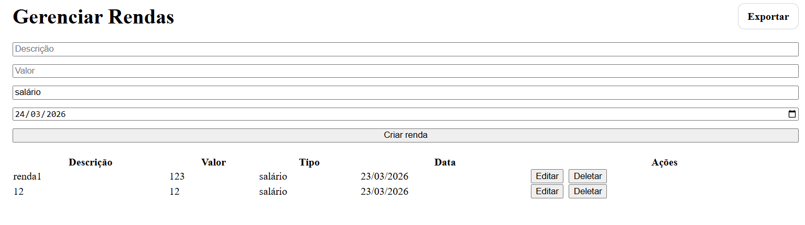
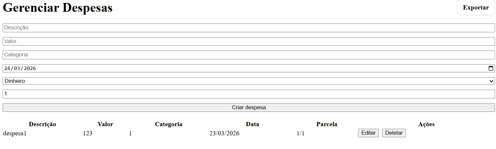
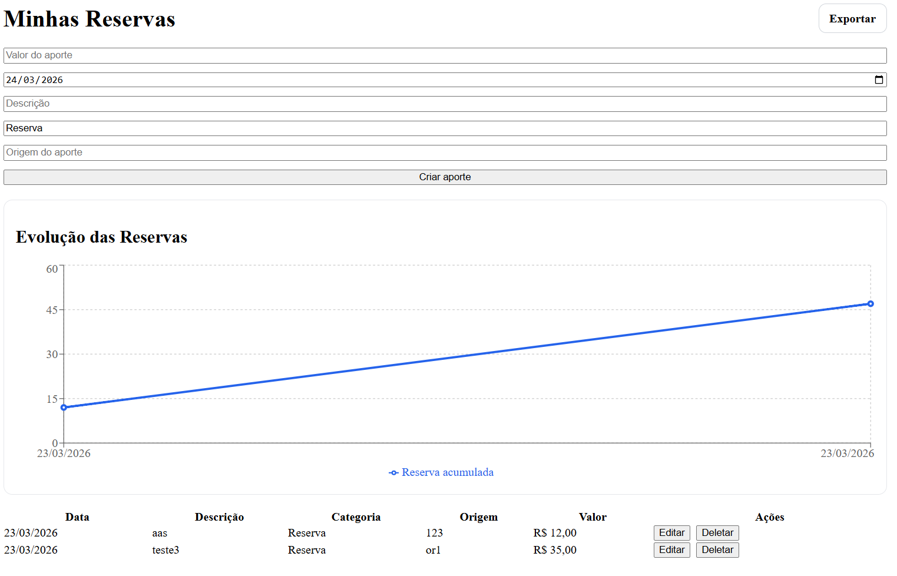
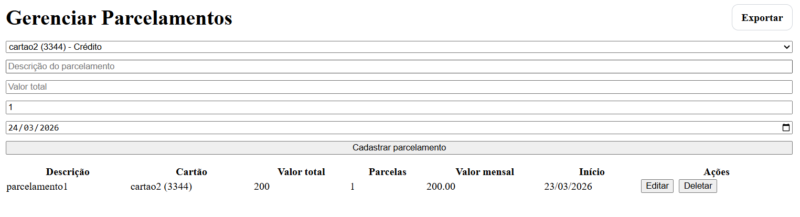
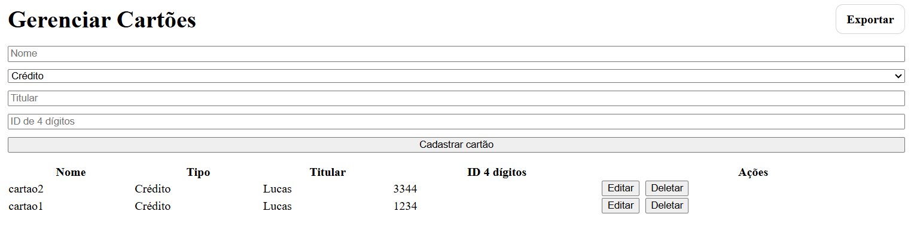
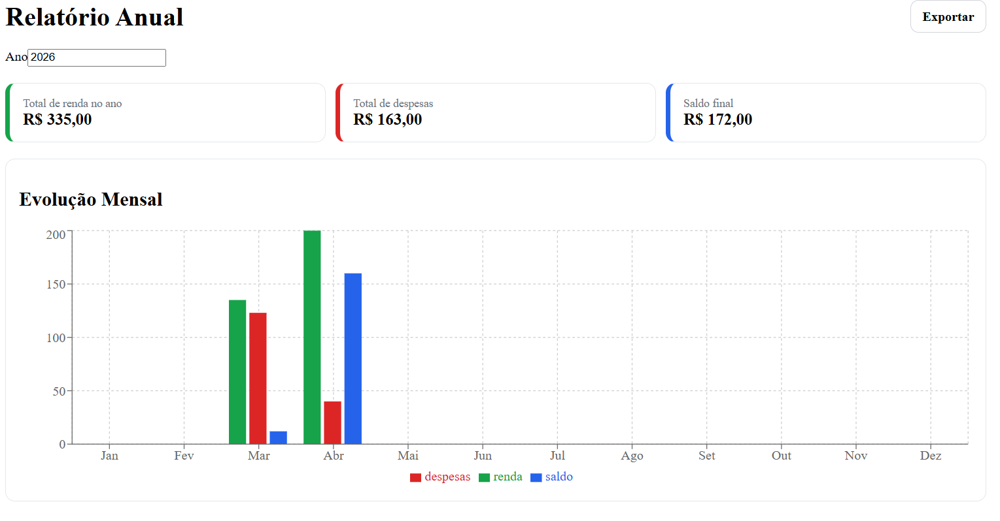

# Sistema de gestão financeira
Aplicação web desenvolvida em Next.js com o intuito de gerir e visualizar informações financeiras. 

## Como executar o projeto

### Clone o repositório
```bash
git clone https://github.com/lucasmanoelfmc/Sistema-de-Gestao-Financeira.git
cd Sistema-de-Gestao-Financeira
```

### Instale as dependências
```bash
npm install
```

### Configure as variáveis de ambiente
Crie um arquivo .env na raíz do projeto e adicione
```bash
MONGODB_URI=sua_string_de_conexao_mongodb
JWT_SECRET=sua_chave_secreta
```
### Execute o projeto
Na raíz do projeto execute
```bash
npm run dev
```
### Acesse no navegador
Abra:
```bash
http://localhost:3000
```

## Funcionalidades

### Dashboard Financeiro
<p align="center">
  
</p>

### Gerenciamento de Renda
<p align="center">
  
</p>

### Gerenciamento de Despesas
<p align="center">
  
</p>

### Gerenciamento de Reservas
<p align="center">
  
</p>

### Gerenciamento de Parcelamentos
<p align="center">
  
</p>

### Gerenciamento de Cartões
<p align="center">
  
</p>

### Emissão de Relatório
<p align="center">
  
</p>